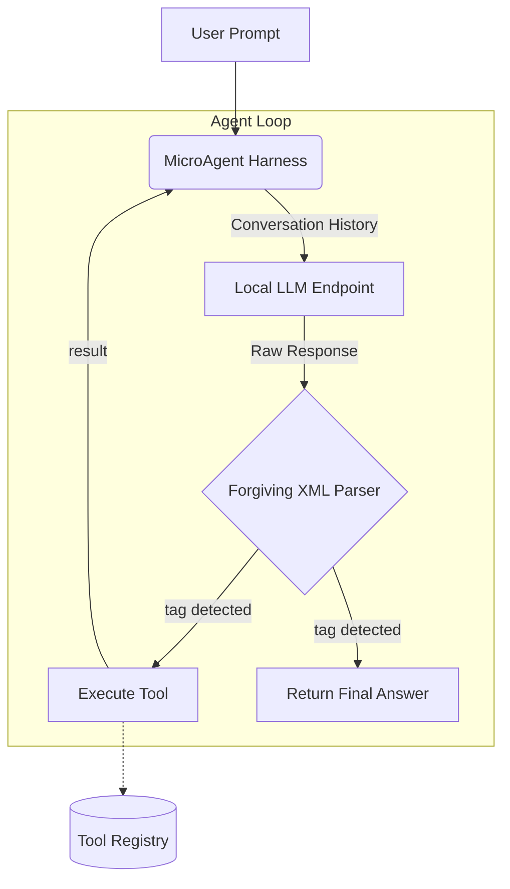

# Tiny Agent Harness

A highly optimized, zero-overhead Rust harness for running agentic loops on sub-500M parameter Language Models.

Small language models (e.g., Qwen1.5-0.5B, Smollm, MobileLLM) are exceptionally fast but struggle with complex JSON schemas, deep reasoning loops, and long context windows. This project provides a specialized harness that does the heavy lifting outside of the model, allowing tiny models to use tools reliably.

## Key Features

- **Zero-Overhead Execution**: Written in Rust (`tokio`, `reqwest`), the harness adds virtually no latency on top of the model inference.
- **Forgiving XML Parser**: Tiny models often fail to close JSON brackets or format structures correctly. This harness uses a regex-based XML tag extractor (`<call>`, `<arg>`) that safely recovers intentions even when the model hallucinates formatting.
- **Trait-Based Tool Registry**: Easily extend the agent's capabilities by implementing the `Tool` trait.
- **Single Binary**: Compiles down to a small, standalone executable.

---

## Architecture

The harness manages the ReAct (Reasoning and Acting) loop by injecting a highly compressed, aggressive system prompt and managing the tool execution state.



---

## The XML Protocol

Instead of forcing the model to generate strict JSON strings, the harness prompts the model to use simple pseudo-XML tags.

**Example Model Output:**
```xml
<thought>I need to find the current weather in Tokyo.</thought>
<call>get_weather</call>
<arg>tokyo</arg>
```

**Harness Injection:**
```xml
<observation>22°C, Sunny</observation>
Now provide your <answer> or make another <call>.
```

**Final Model Output:**
```xml
<answer>The current weather in Tokyo is 22°C and Sunny.</answer>
```

---

## Usage

### 1. Requirements

- [Rust Toolchain](https://rustup.rs/) (1.70+)
- A local LLM runner (e.g., [Ollama](https://ollama.com/), vLLM) exposing an OpenAI-compatible `/v1/chat/completions` endpoint.

### 2. Installation & Setup

**Clone and Build:**
```bash
git clone <repository-url>
cd tiny-agent-harness
cargo build --release
```

The binary will be available at `target/release/tiny-agent-harness`.

**Optional: Install System-Wide:**
```bash
cargo install --path .
```

### 3. Configure Your LLM

By default, the harness connects to `http://localhost:11434/v1` (the default Ollama port). Ensure you have a small model pulled and running. For example:

```bash
# Pull and run a small model with Ollama
ollama pull qwen2.5:0.5b
ollama run qwen2.5:0.5b
```

Keep the Ollama server running in the background while using the harness.

### 4. Run the Harness

**Basic Usage:**
```bash
# Using cargo (development)
cargo run --release

# Using the compiled binary directly
./target/release/tiny-agent-harness
```

**Command Line Options:**

| Option | Short | Default | Description |
|--------|-------|---------|-------------|
| `--model` | `-m` | `qwen2.5:0.5b` | Model name to use |
| `--base-url` | `-b` | `http://localhost:11434/v1` | Base URL of the LLM endpoint |
| `--api-key` | `-k` | `not-needed` | API key for authentication |
| `--max-steps` | `-s` | `5` | Maximum reasoning steps before timeout |
| `--api-gateway` | - | `None` | **Custom API gateway endpoint** (overrides default `{base_url}/chat/completions`) |

**Examples:**

Default usage with local Ollama:
```bash
cargo run --release
# or
./target/release/tiny-agent-harness
```

Specify a custom model and base URL:
```bash
cargo run --release -- --model smollm:135m --base-url http://localhost:11434/v1
```

Use a custom API gateway (for production routing, load balancing, or proxying):
```bash
cargo run --release -- --api-gateway https://my-api-gateway.example.com/v1/chat/completions
```

When `--api-gateway` is provided, it completely overrides the default endpoint construction, allowing you to route requests through custom infrastructure while maintaining the same request/response format.

---

## Extending the Harness (Adding Tools)

To add a new tool, implement the `Tool` trait and register it with the `MicroAgent`.
(Note: The included `WeatherTool` currently returns mocked data for demonstration purposes).

```rust
use tiny_agent::tools::Tool;
use std::error::Error;

pub struct MyCustomTool;

impl Tool for MyCustomTool {
    fn name(&self) -> &str {
        "my_tool"
    }

    fn description(&self) -> &str {
        "Does a custom action."
    }

    fn args_schema(&self) -> Vec<&str> {
        vec!["argument_1"]
    }

    fn execute(&self, args: &[String]) -> Result<String, Box<dyn Error>> {
        // Note: For demonstration purposes, you would return mocked data here
        // or make an HTTP request to a real weather API.
        Ok(format!("Executed with {}", args[0]))
    }
}
```

Register it in `main.rs`:
```rust
agent.register_tool(Box::new(MyCustomTool));
```

---

## License

MIT License
